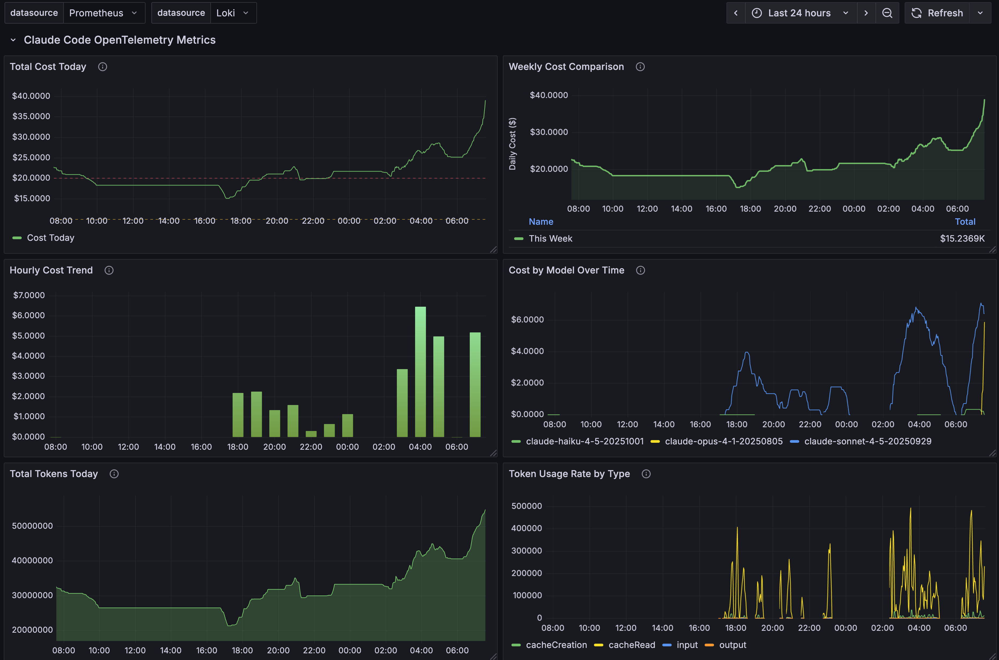
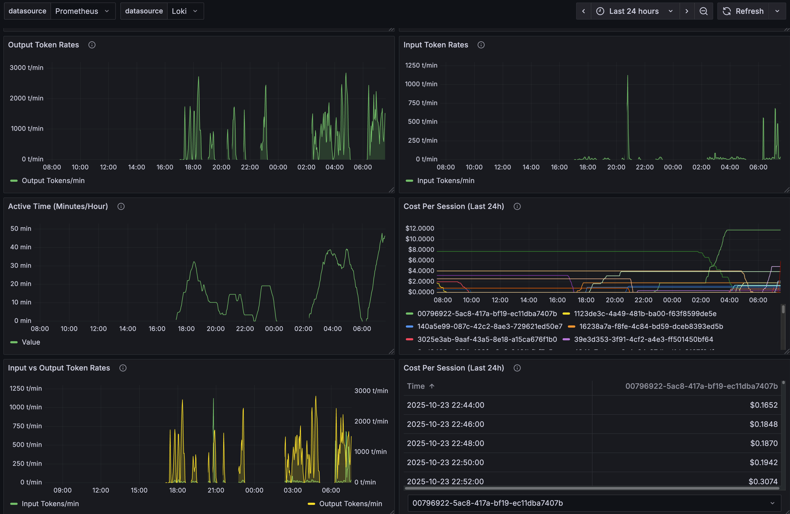

# Claude Code OpenTelemetry Monitoring

Monitor your Claude Code usage with a complete observability stack: OpenTelemetry Collector, Prometheus, Loki, and Grafana. Track costs, token usage, cache efficiency, active time, and code changes in real-time with pre-built dashboards. Watch and check back for updates to this repo for step by step instructions for setting this up. Still fine-tuning the charts and panels. Example screenshots below.

**Based on Official Claude Code Documentation:** Claude Code supports OpenTelemtry as described in Anthropic's [official monitoring documentation](https://docs.claude.com/en/docs/claude-code/monitoring-usage).

---

