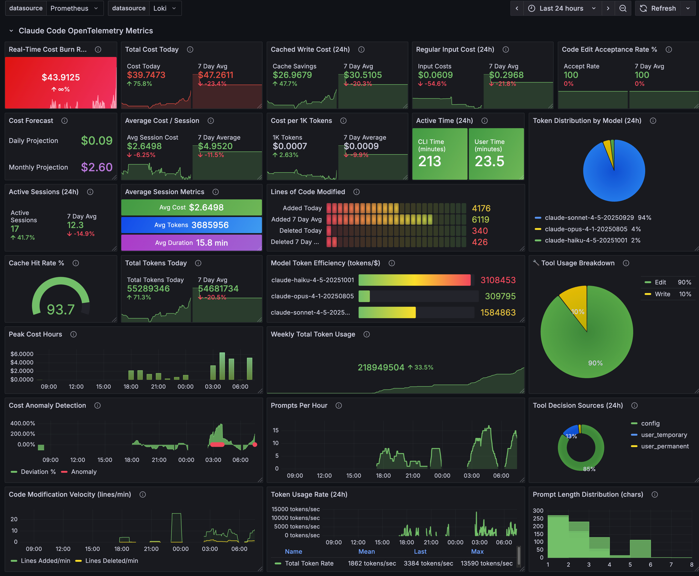

# Claude Code OpenTelemetry Monitoring

Monitor your Claude Code usage with a complete observability stack: OpenTelemetry Collector, Prometheus, Loki, and Grafana. Track costs, token usage, cache efficiency, active time, and code changes in real-time with pre-built dashboards. Watch and check back for updates to this repo for step by step instructions for setting this up. Still fine-tuning the charts and panels. 

An accompanying Claude Code usage metrics MCP server allows Claude Code access to it's own usage metrics (see below example along with example screenshots).

**Based on Official Claude Code Documentation:** Claude Code supports OpenTelemtry as described in Anthropic's [official monitoring documentation](https://docs.claude.com/en/docs/claude-code/monitoring-usage).

---

## Grafana Dashboards




## Claude Code Usage Metrics MCP Server

```bash
claude mcp add --transport stdio metrics -s user -- uv run --directory /path/to/your/mcp-server metrics-server
```

```bash
claude mcp list
Checking MCP server health...

context7: https://mcp.context7.com/sse (SSE) - ✓ Connected
cf-docs: https://docs.mcp.cloudflare.com/sse (SSE) - ✓ Connected
metrics: uv run --directory /path/to/your/mcp-server metrics-server - ✓ Connected
```

### Claude Code Usage Metrics MCP Server Demo


## Claude Code Metrics MCP Server Inspector Tests


